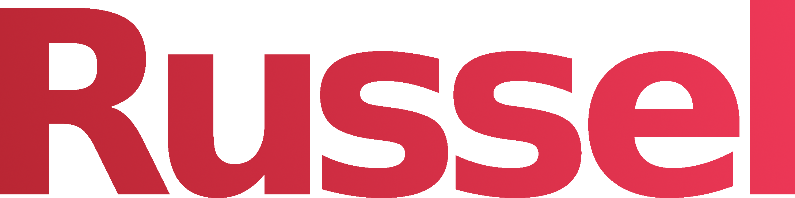

<p align="center">
	
</p>

<p align="center">
	<a href="./LICENSE">
		
	</a>
	<a href="https://github.com/avm-collection/russel/issues">
		
	</a>
	<a href="https://github.com/avm-collection/russel/pulls">
		
	</a>
</p>

### !WARNING!
This is a VERY unfinished language, so expect bugs, many missing features, ugly internal code (im
not responsible for eye damage after the sight), changing syntax and more.

A statically typed programming language compiled to the
[AVM virtual machine](https://github.com/avm-collection/avm) bytecode

## Table of contents
* [Quickstart](#quickstart)
* [Milestones](#milestones)
* [Editors](#editors)
* [Documentation](#documentation)
* [Bugs](#bugs)
* [Make](#make)

## Quickstart
```sh
$ make
$ make install
$ russel -h
```

See [the `./examples` folder](./examples) for example programs. Note that these examples probably
cant be compiled by the current russel compiler, because its not finished yet. Instead, you can
compile programs in [the `./tests` folder](./tests) with
```sh
$ make tests
```

## Milestones
- [X] Lexer
- [X] Parser
- [X] Functions
- [X] If statements
- [X] Variables
- [X] Loops
- [ ] Compile directly to bytecode
- [ ] Type checking
- [ ] Structures
- [ ] Modules
- [ ] Self hosted

## Editors
Syntax highlighting configs for text editors are in the [`./editors`](./editors) folder

## Documentation
(not) Hosted [here](https://avm-collection.github.io/russel/documentation)

## Bugs
If you find any bugs, please create an issue and report them.

## Make
Run `make all` to see all the make rules.
